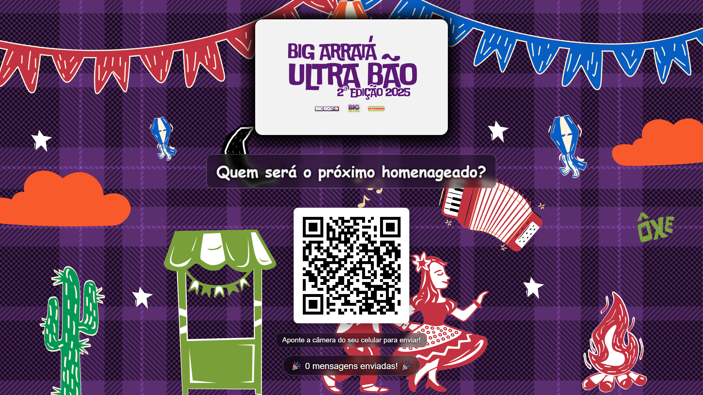

# 💌 Correio Elegante - Big Arraiá Ultra Bão

Sistema completo de correio elegante para eventos, com telão interativo e modo memória animado.


## 🚀 Status: Pronto para Produção

O sistema está completamente funcional e otimizado para uso em eventos reais de grande porte.

## ✨ Funcionalidades Principais

### 📱 **Para Convidados**
- **Envio Simples**: QR Code para acesso rápido via celular
- **Mensagens Flexíveis**: Escolha entre categorias ou escreva a sua
- **Anonimato**: Padrão "Admirador Secreto" ou identifique-se
- **Interface Responsiva**: Funciona perfeitamente em qualquer dispositivo

### 🖥️ **Para o Telão**
- **Exibição Elegante**: Layout de cartão com aspas decorativas animadas
- **Fila Inteligente**: Tempo de exibição ajustado automaticamente
- **Modo de Espera**: QR Code grande e contador de mensagens
- **Modo Memória**: Animações coloridas e divertidas
- **Controles Manuais**: Atalhos F9/F10 para controle durante eventos
- **Narração por Voz**: Cada mensagem é lida automaticamente
- **Suporte Multi-telão**: Sincronização perfeita entre múltiplos displays

### 🔧 **Para Administradores**
- **Painel Seguro**: Acesso protegido por senha
- **Monitoramento**: Clientes conectados em tempo real
- **Estatísticas**: Dados completos do evento
- **Gerenciamento**: Mensagens e categorias configuráveis
- **Histórico**: Log completo de todas as mensagens

## 🎨 Modo Memória Melhorado

### ✨ **Melhorias Visuais**
- **Fundo animado** com gradientes coloridos
- **Cards coloridos** com gradientes aleatórios
- **Animações de entrada** variadas (bounce, slide, fade, rotate, zoom)
- **Emojis flutuantes** decorativos
- **Efeitos de hover** interativos
- **Rotação sutil** nos cards
- **Scroll automático** com velocidade otimizada para leitura
- **Quebra de texto inteligente** para mensagens longas

### 🎮 **Controles Manuais**
- **F9**: Ativa modo memória (se houver mensagens)
- **F10**: Volta ao modo de espera
- **Indicador visual** sutil dos atalhos

## 🎪 Preparado para Eventos Grandes

### 📊 **Performance Testada**
- ✅ Testado com **200+ convidados simultâneos**
- ✅ Suporte para **múltiplos telões sincronizados**
- ✅ Fila otimizada para **alto volume de mensagens**
- ✅ Sistema de **interrupção inteligente** (mínimo 20s por mensagem)

### 🔊 **Recursos de Áudio**
- **Narração automática** de cada mensagem
- **Vozes em português** (pt-BR)
- **Variação de tom e velocidade** para naturalidade
- **Som de notificação** para novas mensagens na fila

### 🖥️ **Multi-Telão**
- **Sincronização perfeita**: Todos os telões mostram a mesma mensagem
- **Controle centralizado**: Servidor aguarda todos os displays
- **Narração local**: Cada dispositivo usa sua própria voz
- **Redundância**: Se um telão cair, os outros continuam

## 🛠️ Instalação e Uso

### Pré-requisitos
- Node.js 14+
- NPM ou Yarn

### Instalação Rápida
```bash
# Clone o repositório
git clone https://github.com/rodrigoantonioli/correio-elegante-bigbox.git
cd correio-elegante-bigbox

# Instale as dependências
npm install

# Configure as variáveis de ambiente
cp .env.example .env
# Edite o arquivo .env com suas configurações

# Inicie o servidor
npm start
```

### Configuração
Crie um arquivo `.env` na raiz:

```bash
# === OBRIGATÓRIAS ===
ADMIN_PASSWORD=sua_senha_super_secreta
SESSION_SECRET=uma_frase_bem_longa_e_aleatoria_para_seguranca

# === OPCIONAIS ===
PORT=3000
NODE_ENV=production

# === LOG EM NUVEM (OPCIONAL) ===
GITHUB_TOKEN=seu_token_do_github
GIST_ID=id_do_seu_gist
GIST_FILENAME=log_evento.log
```

### Acesso
- **Envio de Mensagens**: `http://localhost:3000`
- **Telão**: `http://localhost:3000/display`
- **Login Admin**: `http://localhost:3000/login`
- **Painel Admin**: `http://localhost:3000/admin` (após login)

## 📁 Estrutura do Projeto

```
CorreioElegante/
├── public/                 # Frontend (HTML, CSS, JS)
│   ├── css/               # Estilos
│   ├── js/                # JavaScript do cliente
│   ├── images/            # Imagens
│   ├── audio/             # Sons
│   ├── index.html         # Página principal
│   ├── display.html       # Telão
│   └── login.html         # Login admin
├── private/               # Páginas administrativas
├── docs/                  # Documentação
│   ├── API.md            # Documentação da API
│   ├── DEPLOYMENT.md     # Guia de deploy
│   └── CONTRIBUTING.md   # Guia de contribuição
├── test/                  # Testes automatizados
├── server.js              # Servidor principal
├── messages.json          # Configuração de mensagens
└── package.json           # Dependências
```

## 🎯 Configuração

### Mensagens Pré-definidas
Edite `messages.json` para personalizar:

```json
{
  "categories": ["Geral", "Romântico", "Amizade", "Família"],
  "messages": [
    {
      "text": "Sua beleza é como um bug no meu coração!",
      "category": "Romântico"
    },
    {
      "text": "Você é incrível!",
      "category": "Amizade"
    }
  ]
}
```

### Personalização Visual
- **Logo**: Substitua `public/images/logo.png`
- **Cores**: Edite as variáveis CSS em `public/css/style.css`
- **Sons**: Substitua `public/audio/notification.mp3`

## 🚀 Deploy

### Render.com (Recomendado)
1. Conecte seu repositório GitHub
2. Configure as variáveis de ambiente
3. Deploy automático a cada push

### Outras Plataformas
- **Heroku**: Compatível
- **Vercel**: Compatível
- **DigitalOcean**: Compatível

Veja o [Guia de Deploy](docs/DEPLOYMENT.md) para instruções detalhadas.

## 🔒 Segurança

### Autenticação
- Sessões baseadas em cookies
- Senha única para área administrativa
- Bloqueio de IPs maliciosos

### Validação
- Sanitização de entrada de dados
- Limitação de tamanho de mensagens
- Rate limiting implícito

### Logs
- Logs detalhados de todas as operações
- Histórico de mensagens persistente
- Monitoramento de erros

## 📊 Monitoramento

### Estatísticas Disponíveis
- Total de mensagens enviadas
- Mensagens mais populares
- Destinatários mais homenageados
- Clientes conectados em tempo real
- Pico de conexões simultâneas

### Logs
- **Local**: `message_history.log`
- **Remoto**: GitHub Gist (opcional)
- **Console**: Logs em tempo real

## 🧪 Testes

### Execução
```bash
npm test
```

### Cobertura
- Testes de servidor (Jest + Supertest)
- Testes de concorrência
- Testes de integração

## 📚 Documentação

### Guias Disponíveis
- **[API Documentation](docs/API.md)** - Documentação completa da API
- **[Deployment Guide](docs/DEPLOYMENT.md)** - Guia de deploy detalhado
- **[Contributing Guide](docs/CONTRIBUTING.md)** - Como contribuir
- **[AGENTS.md](AGENTS.md)** - Instruções para desenvolvedores

### Recursos Externos
- [Socket.IO Documentation](https://socket.io/docs/)
- [Express.js Documentation](https://expressjs.com/)
- [Node.js Documentation](https://nodejs.org/docs/)

## 🤝 Contribuindo

Contribuições são bem-vindas! Veja o [Guia de Contribuição](docs/CONTRIBUTING.md) para:

- Como reportar bugs
- Como sugerir features
- Como contribuir com código
- Padrões de desenvolvimento

## 🆘 Suporte

### Problemas Comuns
1. **Verifique os logs** do servidor
2. **Consulte a documentação** em `docs/`
3. **Teste os atalhos** F9/F10 no telão
4. **Verifique as variáveis** de ambiente

### Recursos de Ajuda
- [Issues do GitHub](https://github.com/rodrigoantonioli/correio-elegante-bigbox/issues)
- [Documentação](docs/)
- [AGENTS.md](AGENTS.md) para desenvolvedores

## 📄 Licença

Este projeto está sob a licença MIT. Veja o arquivo [LICENSE](LICENSE) para mais detalhes.

## 🙏 Agradecimentos

- **Socket.IO** pela comunicação em tempo real
- **Express.js** pelo framework web
- **Comunidade Node.js** pelo ecossistema
- **Contribuidores** que ajudaram a melhorar o projeto

---

**Desenvolvido com ❤️ para tornar eventos mais especiais!**



## 📈 Dicas para Eventos Grandes

### 🎯 **Preparação**
1. **Teste antecipadamente** o sistema completo
2. **Configure múltiplos telões** se o espaço for grande
3. **Ajuste o volume** dos dispositivos (narração)
4. **Tenha backup** de internet (4G/5G)

### 🚀 **Durante o Evento**
1. **Monitore a fila** pelo painel admin
2. **Use F9/F10** para controlar o modo memória
3. **Acompanhe as estatísticas** em tempo real
4. **Bloqueie IPs** se houver abuso

### 💡 **Recomendações**
- **Internet**: Mínimo 10 Mbps para 200 pessoas
- **Telões**: 1 para cada 100 pessoas
- **Posicionamento**: Telões visíveis de todos os ângulos
- **Som**: Volume ajustado para não interferir na festa
